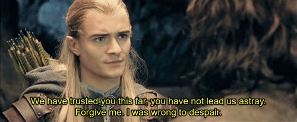

# Note Taker App 
  

  ## Reflections:

It might just be me, but it seems the assignments have made a substantial leap in complexity. I'm being a bit rhetorical and hyperbolic admittedly.

 

### To use an analogy: 

 

It feels as if we had been learning fairly straight forward games and then played them. We're given a brief explanation, a few practice rounds, then our homework assignment is to actually compete in the game by mid-way through learning the next game. 

Every new game learned would be slightly more complex than the last, but in a steady progression. We'd first learn quarters, then horseshoes, then darts, then billiards.

This current assignment feels like we've gone from billiards to American football. And again, in the same amount of time to learn the rules and complexities as the previous, far simpler games.

Again, it might just be me, but I can't learn and play football in the same brief amount of time it takes to learn and play horseshoes.

 

### To be clear though...

 

This reflection is not meant to serve as a criticism of the curriculum by any means. I don't believe this perceived jump in complexity is necessarily even true, let alone problematic (if true). The whole program is aptly named a 'bootcamp' as the pace and learning environment is finely curated to be precisely that: accelerated, fast paced, and challenging. I've always understood, embraced, and celebrated that fact. Admittedly, this is my own subjective experience on this particular assignment, likely due to a failure of preparedness on my part.

 

 

### Admission of Defeat

I know which class activities we're meant to emulate for this assignment, and I've made the slightest of headway, but just become overwhelmed by this assignment. And now having already moved on to mySQL and databases I just feel completely lost right now. Might've needed an extra week, more activities, or who knows... but I feel this ship has sailed and I can't see much more I could do with this assignment save copy someone else's work and pretend like I understand it... which obviously I don't intend to do.

  ## CONTRIBUTION
 Just me... or else it'd have probably gotten finished.

  ## QUESTIONS
  For further questions please contact me:  
  GitHub: DesmondAldridge  
  Email: desmondaldridge@gmail.com